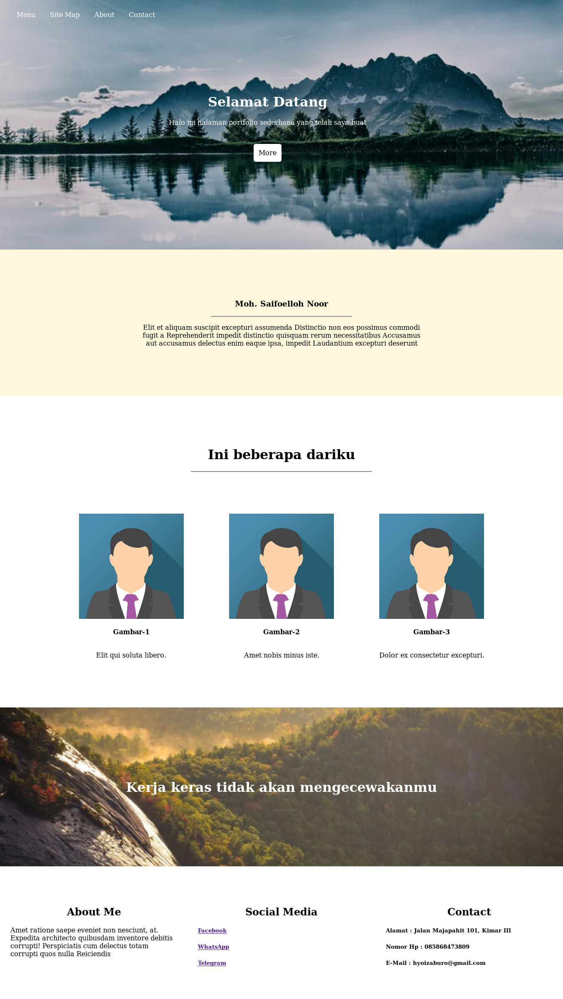

Halaman Portfolio Sederhana

Alat yang harus disiapkan :
  1. Code Editor
  2. Clone Repo Ini
  3. Niat
  4. Camilan
  
Langkah-langkah :
1. Buat folder baru dengan nama "new folder"
2. Pindah ke folder tersebut
3. Buat file baru berupa "index.html", "style.css"
4. Download repo ini
5. Extract {"repo"}.zip
6. Pindahkan folder "img" kedalam folder yang sudah kita buat
7. Buka folder projek kita menggunakan Code Editor
8. Ikuti Langkah-langkah selanjutnya dalam video
